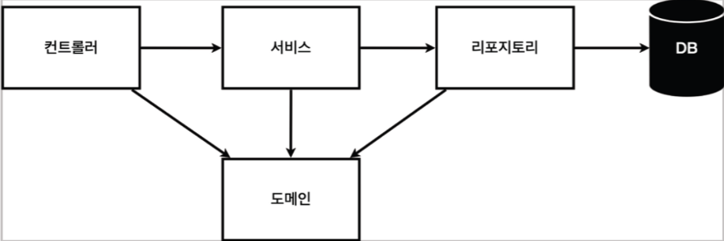
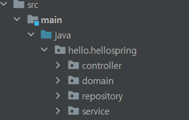
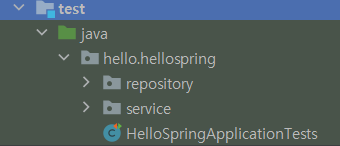

# 스프링 웹 애플리케이션 계층 구조

- 컨트롤러: 웹 MVC역할, 외부의 요청을 받음
- 서비스: 핵심 비즈니스 로직을 구현
- 도메인: 도메인 객체 (엔티티)
- 리포지토리: DB에 접근하여 저장및 관리
컨트롤러를 통해 외부요청을 받고 서비스에서 비즈니스로직에 따라 처리 리포지토리로 DB에 접근하여 저장.

## 프로젝트 관리

- java 패키지 않에 컨트롤러, 서비스, 도메인, 리포지토리 패키지를 만들고 거기에 맞는 클래스 및 인터페이스를 생성하는 방식이다.
- 테스트 케이스가 있는데 테스트용으로 클래스별, 메소드별로 실행 시켜 볼 수 있게 만들어 둔 기능이다.

- 테스트 케이스를 관리하는 패키지이다. main이 아닌 test패키지가 따로 생성되어 있으며 여기에 마찬가지로 패키지별 클래스를 작성하여 테스트한다.
